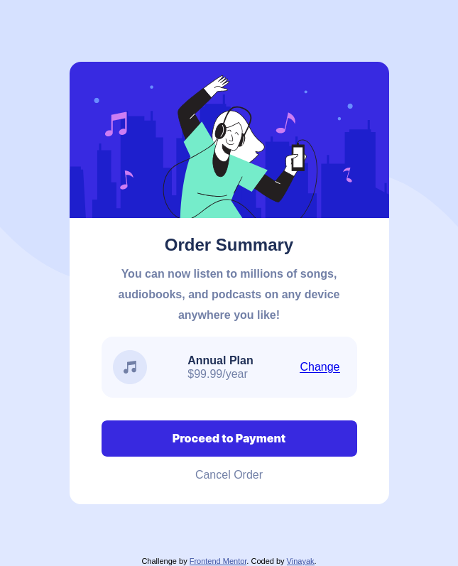

# Frontend Mentor - Order summary card solution

This is a solution to the [Order summary card challenge on Frontend Mentor](https://www.frontendmentor.io/challenges/order-summary-component-QlPmajDUj). Frontend Mentor challenges help you improve your coding skills by building realistic projects. 

## Table of contents

- [Overview](#overview)
  - [The challenge](#the-challenge)
  - [Screenshot](#screenshot)
  - [Links](#links)
- [My process](#my-process)
  - [Built with](#built-with)
  - [What I learned](#what-i-learned)
  - [Continued development](#continued-development)
 
- [Author](#author)


## Overview
Build a order summary card component and get it looking as close to the design as possible.

### The challenge

Users should be able to:

- See hover states for interactive elements

### Screenshot



### Links

- Solution URL: [gtihub repo](https://github.com/VinayakDhamnekar/FrontEndMentot-OrderSummary)
- Live Site URL: [Vercel](https://fm-ordersummary.vercel.app/)

## My process

### Built with

- Semantic HTML5 markup
- CSS custom properties
- CSS - Flexbox

### What I learned

- Use css flexbox
-Overide default button style:
```button{
    border:none;
    cursor: pointer;  
    background: none;
    margin: 0;
    color:black ;
    
}
use CSS variables:
```
:root {
    --primary-pale-blue: hsl(225, 100%, 94%);
    --primary-bright-blue: hsl(245, 75%, 52%);
    --neutral-pale-blue: hsl(225, 100%, 98%);
    --neutral-des-blue: hsl(224, 23%, 55%);
    --neutral-dark-blue: hsl(223, 47%, 23%);
}
div{
background-color: var(--neutral-pale-blue); }
```


### Continued development
Bulid it to be more responsive on smaller screen(scale image size and font size based on the screen size).


## Author
- Frontend Mentor - [@VinayakDhamnekar](https://www.frontendmentor.io/profile/VinayakDhamnekar)

